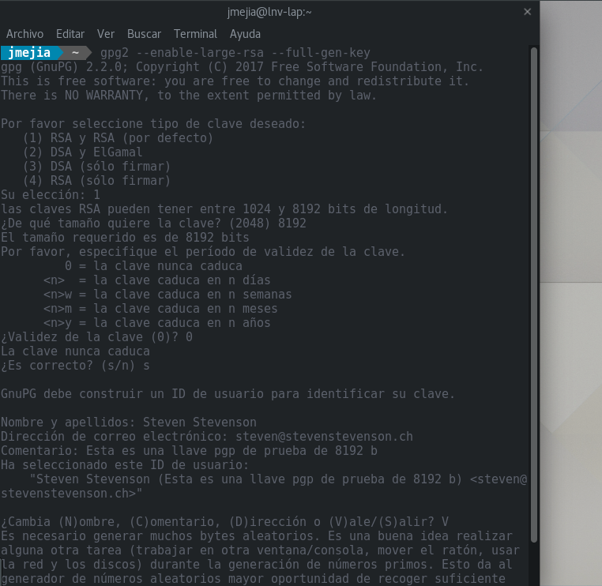
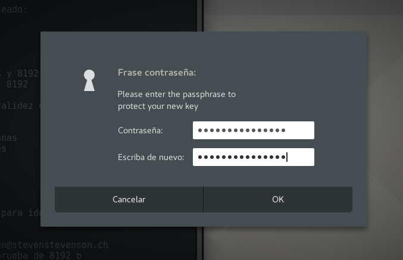
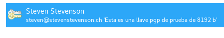

¿Quieres crear una llave de ese tamaño? No busques más.

# Generando una llave PGP de 8192 bits


## ¿Qué es una llave PGP?
En el cifrado asimétrico se necesitan, por persona, un par de llaves  – una pública y una privada. A grosso modo, una llave pública se utiliza por Alice para cifrar un mensaje para Bob (con la llave pública de Bob) y cuando Bob reciba el mensaje, usará su llave privada para descifrar el mensaje de Alice. Una lectura más a profundidad sobre PGP puedes encontrarla [acá](https://ssd.eff.org/es/module/una-introducci%C3%B3n-la-criptograf%C3%ADa-de-llave-p%C3%BAblica-y-pgp). ¡Props a la EFF!  

La seguridad de las llaves PGP depende de su longitud, es decir, entre más grande sea la longitud serán más seguras. Sin embargo, en este post no nos enfocaremos en por qué deberías tener una llave PGP de tamaño superior para cifrar tus conversaciones, para eso deberías leer acá.
Ahora, si eres una persona que toma en serio la privacidad y seguridad de tus conversaciones (y estoy seguro de que por eso lees este post) seguro querrás tener una llave PGP infranqueable.  


### Estado del arte de las llaves PGP
Algunos investigadores han logrado "romper" llaves PGP de hasta ~700 bits, es decir, las computadoras, la tecnología y las matemáticas actuales no permiten romper llaves de mayor longitud.  

Ahora, lo estándar para garantizar una seguridad óptima es 2048 bits. Esto es, al año 2017, una llave de longitud 2048 bits es suficiente para garantizar la privacidad de tus conversaciones por email. Sin embargo, como del CEO de Intel dijo alguna vez «sólo los paranóicos sobreviven»  – hay que tener en cuenta que el avance de las ciencias de la computación y la ciber-seguridad en general en algún momento permitirá romper llaves de esta longitud, es inevitable, la NSA y afines siempre [intentarán romper nuestra privacidad](https://www.theguardian.com/world/2013/sep/05/nsa-how-to-remain-secure-surveillance), es por eso que debemos anticiparnos a estos avances y tomar las medidas de precaución adecuadas.[¹](#notas) [²](#notas) [³](#notas)


#### Llaves seguras a futuro
Sí, suena como demasiado crear una llave de 8192 bits por qué lo óptimo a 2017 es 2048 bits, pero si, como yo, quieres estar anticipado al futuro acompáñame y creemos tu súper llave.


#### ¿Qué vas a necesitar?
*Linux de tu preferencia  
*PGP instalado


##### Entropía

Cuando se generan llaves PGP se necesita que haya suficiente entropía en el sistema donde las estamos creando. ¿Cómo logramos esto? Haciendo cosas.  
Claro, ya puedo verte haciendo un facepalm. Lo que sucede es que como humanos somos malos al elegir procesos que realizar que sean óptimos para generar una entroía adecuada. [Aquí](https://socpuppet.blogspot.mx/2014/09/howto-quickly-generate-8k-bit-pgp-keys.html) hay 3 métodos para lograrlo.

Usaremos el primero -- un *loop* en varias shell, 3 por lo menos.
* Crea un archivo `~/entropyg.sh` que contenga lo siguiente (listaremos algunos directorios una y otra vez):
	```
	B=0

	while [ $B -lt 10 ] ; do ls -lR ; done 
	```
* Ejecútalo en 3 terminales diferentes con `sh entropy.sh` en cada una.  
* Empieza el proceso de creación de tu llave PGP con `gpg2 --enable-large-rsa --full-gen-key` (elige 8192y completa la información, por ejemplo, tu nombre y correo) y confirma.  

  

Se te pedirá una contraseña que desbloqueará la llave cuando se intente usar en cualquier lugar, algo así como una verificación en 2 pasos para tus correos. Es decir, algo que tienes (tu llave privada PGP) y algo que conoces (la contraseña que la desbloquea).   

   

Ahora, el equipo en el que escribo este post no tiene mucho poder de procesamiento y no habrá tardado más de unos 3 minutos en generar la llave de prueba para este post. Recordemos que para crear las llaves PGP debe realizar muchos procesos matemáticos bastante complejos, por lo que, si tenemos un equipo potente terminará antes.  

Pudiste ir por un café en lo que tu llave era creada y cuando regresaste tu consola te recibión con la información resumida de la operación que acabas de completar, los identificadores de estas llaves, tu nombre y correo -- la cual también puedes ver ejecutando `seahorse` y buscando en el paaratado `Claves GnuPG`.  

   

Si ves esa información es que el proceso se completó exitosamente (¡yay!) y puedes disfrutar esa taza de café sabiendo que tus correos estarán protegidos por el poder de las matemáticas.


# Notas

[1] [Researchers: 307-digit key crack endangers 1024-bit RSA](Researchers: 307-digit key crack endangers 1024-bit RSA)  
[2] [Key size and encryption system](https://en.wikipedia.org/wiki/Key_size#Key_size_and_encryption_system)  
[3] [Anatomy of a change – Google announces it will double its SSL key sizes](https://nakedsecurity.sophos.com/2013/05/27/anatomy-of-a-change-google-announces-it-will-double-its-ssl-key-sizes/)
