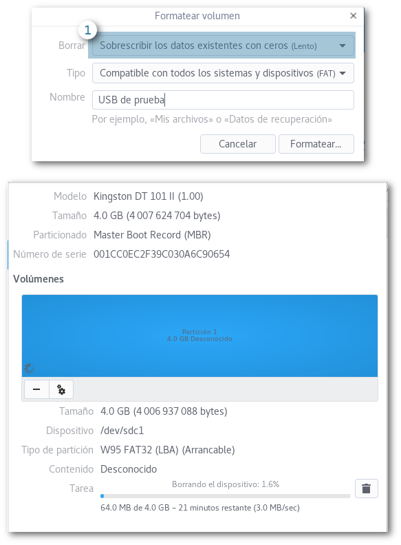

¿Qué es peor que eliminar un archivo por accidente? No encontrarlo ni en la papelera de reciclaje. `*horror.ogg*`  

# O cómo recuperar las fotos que borraste por accidente

## ¿Se fueron para siempre?

TL;DR; **No.**  
Cuando elminamos un archivo de cualquier dispositivo de almacenamiento (ya sea una USB, un disco duro externo o el que viene con nuestra PC) lo único que el sistema operativo hace es `*marcar*` el espacio de almacenamiento ocupado por ese archivo como `Disponible`. Pero el compendio de `0`s y `1`s de nuestro archivo sigue ahí, por un tiempo.  
¿Hasta cuando? Hasta que el sistema necesite ese espacio para algún otro archivo y decida utilizarlo. Es por eso que en estos casos las escrituras a disco (o al dispositivo de almacenamiento) son nuestro peor enemigo, y empieza nuestra carrera contra el tiempo. Esto en caso de que sea el disco duro de nuestra PC, por que, en dispositivos de almacenamiento como USB's realmente se escribe hasta que nosotros digamos, pero no te confíes tanto.  

Este post realmente es un experimento con las dos herramientas antes mencionadas: 
* PhotoRec
* Scalpel  

Ambas nos pueden ayudar en estos casos pero son un poco diferentes. **No intenten esto en casa, o sí.**    
Para sistemas Windows lo único que he usado es Recuva, el cual funciona bien. No ahondaremos en él, por que el objetivo es recuperar archivos en sistemas Linux.  

### Formateando una USB
Lo primero que hice fue formatear una USB que ya no utilizo, lo importante es sobreescribir los contenidos para ver el funcionamiento de las herramientas que vamos a usar.

  
*[1] Especificar que sobreescriba el almacenamiento con 0s y 1s*  

Y después de unos minutos, dependiendo de tu equipo, tendremos una USB fresca y lista para nuestro experimento.  

### Llenando la USB

Usaremos dos tipos de archivos para esta prueba:  
* Imágenes (wallpapers oficiales de Fedora)  
* Archivos de texto (Markdown; usaremos un script para generar muchos ¡yay!)  

Ejecuté este código sobre la memoria que formateamos, el cuál creará `i` directorios con 1 archivo de markdown cada uno:  


#!/bin/bash

#script to generate tree folder of a boook (chapters only), will create  01-, 02-, ... XX folders with a 01-capterxx.markdown file

for i in {1..20}
do
   mkdir 0$i- && echo "$i Lorem ipsum dolor sit amet, conse$i ctetur adipiscing elit. Donec ultricies nibh et leo tincidunt porttitor. Integer diam lorem,$i dapibus et fermentum in, faucibus a veli$i t. Morbi finibus consectetur suscipit. Cras sit amet tortor vitae risus molestie egestas at vitae nisl. Phasellus non turpis vel augue$i dapibus porta at at purus. Maecenas $i aliquet gravida neque eget posuere. Ut feugiat neque purus, sit amet vulputate arcu consequat nec. Sed quis viverra magna. Nunc blandit magna et risus ultrices, sit amet tempus enim placerat. Morbi eu efficitur augue. $i" > 01-chapter0$i.markdown  && mv 01-chapter0$i.markdown 0$i-/
done
  
*Modifica i para crear los que tu corazón desee*  

El árbol de archivos (`$ tree .`) se verá de la siguiente forma:  

.
└── USB de prue
    └── Prueba
        ├── Imágenes
        │   └── Fedora Wallpapers
        │       ├── F23.jpg
        │       ├── F24-standard_wiki.png
        │       ├── F26-final-day-default-wallpaper-standard.png
        │       └── Fedora-25-wallpaper.png
        └── Markdown
            ├── 01-
            │   └── 01-chapter01.markdown
            ├── 010-
            │   └── 01-chapter010.markdown
            ├── 011-
            │   └── 01-chapter011.markdown
            ├── 012-
            │   └── 01-chapter012.markdown
            ├── 013-
            │   └── 01-chapter013.markdown
            ├── 014-
            │   └── 01-chapter014.markdown
            ├── 015-
            │   └── 01-chapter015.markdown
            ├── 016-
            │   └── 01-chapter016.markdown
            ├── 017-
            │   └── 01-chapter017.markdown
            ├── 018-
            │   └── 01-chapter018.markdown
            ├── 019-
            │   └── 01-chapter019.markdown
            ├── 02-
            │   └── 01-chapter02.markdown
            ├── 020-
            │   └── 01-chapter020.markdown
            ├── 03-
            │   └── 01-chapter03.markdown
            ├── 04-
            │   └── 01-chapter04.markdown
            ├── 05-
            │   └── 01-chapter05.markdown
            ├── 06-
            │   └── 01-chapter06.markdown
            ├── 07-
            │   └── 01-chapter07.markdown
            ├── 08-
            │   └── 01-chapter08.markdown
            ├── 09-
            │   └── 01-chapter09.markdown
            └── create.sh

25 directories, 25 files
  

¿El paso siguiente? ¡Borrar todo con `Shift + supr`! No queremos que nuestros archivos se vayan a `.Trash`, queremos deshacernos de ellos por completo (casi).  

  

### La carpeta está vacía  

Eso es cierto, pero técnicamente nuestros archivos siguen vivos. 

