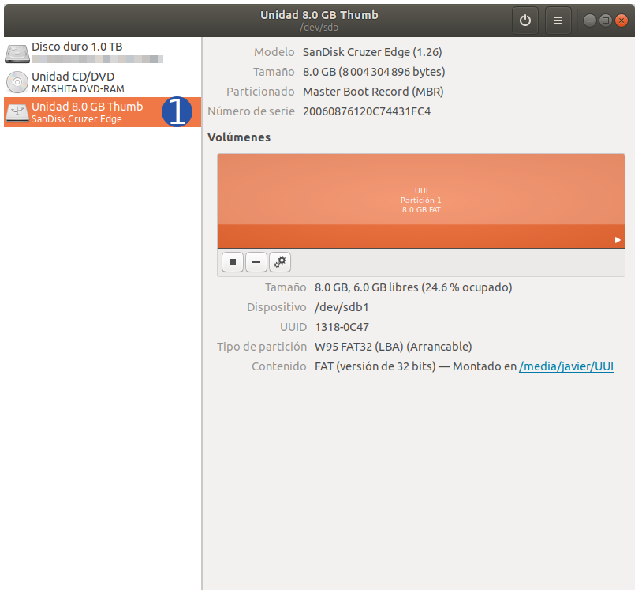
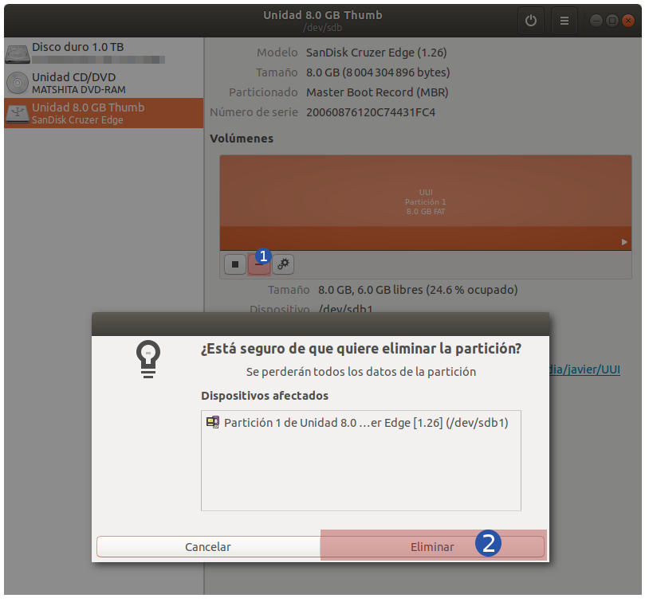
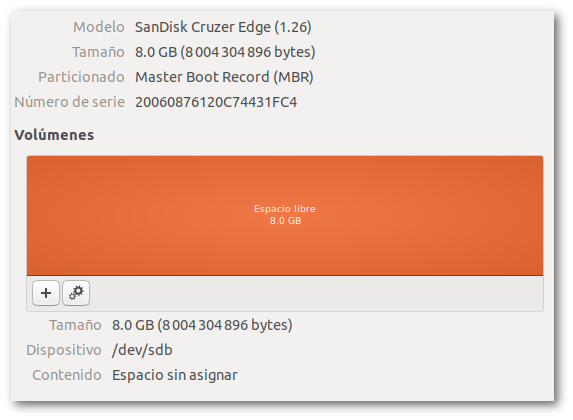
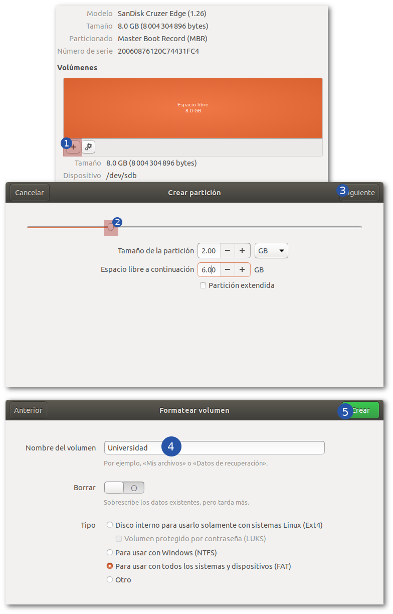
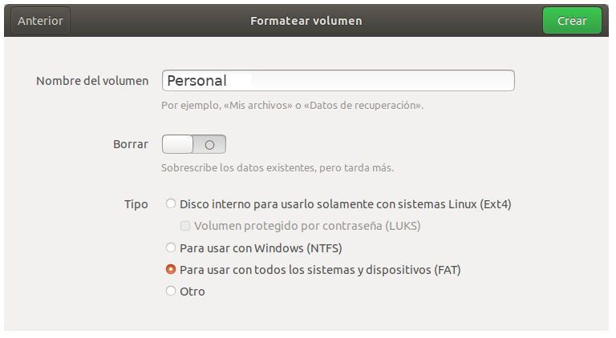
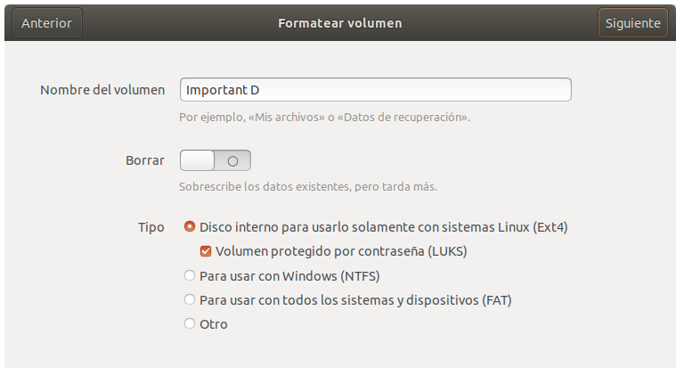
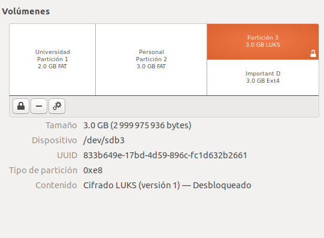

¿Por qué particionar? Tener varias particiones en una USB/DISCO extraíble puede ser bastante útil; puedes organizarte mejor con tus archivos y te da mas control sobre tus dispositivos.  

## Requisitos  
* Ubuntu reciente. A la fecha de este post, la version más actual es Ubuntu 18.04.1 LTS, pero en teoría cualquier Linux moderno puede servir para nuestros propósitos.  
* Utilidad de discos de Gnome. Referente al punto anterior, incluso Fedora, Mint, etc. pueden correr esta utilidad. Para ver si la tienes inatalada ejecuta en un shell (`Alt + F2 > escribe gnome-terminal`): `~$ man gnome-disks`, si te contesta con `Ninguna entrada del manual para gnome-disks` (que es una posibilidad remota) puedes instalarla con el siguiente comando: `sudo -y apt-get install gnome-disks` y listo.  
* Una USB. Realmente la capacidad no importa, pero entre más capacidad tenga podremos hacer más particiones.  

## ¿Cómo?  

### Inserta tu USB  
Para este ejemplo usaremos una USB de la cual la información que contiene no nos interesa ya, pero de igual forma, si tu usb contiene información te recomiendo que hagas un respaldo primero.  

### Abre Gnome-disks 
Puedes hacerlo directamente desde el menú de `Aplicaciones` o tecleando en una shell: `gnome-disks`  
Verás una aplicación como la siguiente (da click sobre tu USB):  
  

### Elimina la partición actual  
Seguramente sólo hay una partición en esa USB y también seguro es FAT32. En este caso la eliminaremos para empezar de cero.   

  

1. Click en el signo de `-`.   
2. Confirma la elminación de esa partición.   

Tu USB quedará de la siguiente forma:  

  

### Crea las nuevas particiones  

Crearemos 3 particiones, a saber, 2 particiones FAT y una tipo LUKS; de 2GB, 3GB y 3GB respectivamente. Siéntete libre de cambiar mi configuración para que se ajuste a tus necesidades.  

#### Primera partición - FAT  

1. Click sobre el símbolo de `+`.  
2. Desliza hasta obtener el tamaño adecuado, puedes jugar con los demás valores.  
3. Click en `Siguiente`.  
4. Dale un nombre a la partición, en este caso `Universidad`. No modifiques nada más.  
5. Click en `Crear`.   

  

#### Segunda partición - FAT  

1. Click sobre el "Espacio libre"    
2. Click sobre el símbolo de `+`.  
3. Desliza hasta obtener el tamaño adecuado, puedes jugar con los demás valores.   
4. Click en `Siguiente`.  
5. Dale un nombre a la partición, en este caso `Personal`. No modifiques nada más.  
6. Click en `Crear`.  

  

#### Tercera partición - LUKS  

1. Click sobre el "Espacio libre"  
2. Click sobre el símbolo de `+`.  
3. Desliza hasta obtener el tamaño adecuado, puedes jugar con los demás valores. Acá puedes dejarlo hasta el final, puesto que se usará el espacio restante.  
4. Click en `Siguiente`.  
5. Dale un nombre a la partición, en este caso `Important D`. Selecciona en Tipo `Disco interno para usarlo solamente con sistemas Linux (Ext4) > Volumen protegido con contraseña (LUKS)`.  
6. Elige una contraseña robusta, asegurate de recordarla o puedes elegir una contraseña desde KeepassXC o 1Password.
6. Click en `Crear`.  

  

Listo, ahora tienes una USB con 3 particiones internas:  
* Una para cosas de la universidad.  
* Una para cosas personales.  
* Una para guardar documentos importantes.  

Ahora tu USB en `gnome-disks` debe verse de la siguiente manera:  

  

EZ PZ.  
  
