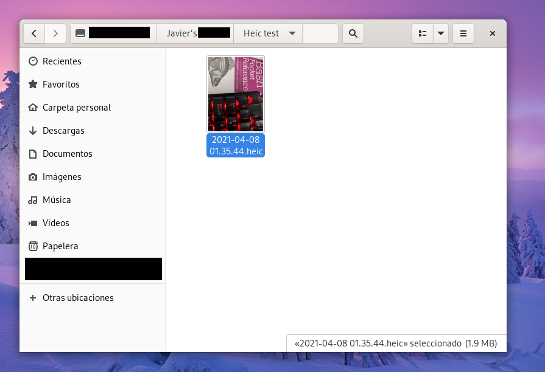

HEIC is the new standard for image/video files on iOS ecosystem and by default are not recognized on Fedora. There is a very easy way to fix this and its installing the library that lives on rpmfusion-free repository.
We can install it as simple as typing:


$ sudo dnf install libheif


And it's done:

   

We can see the preview for the heic file is created and your default or favorite image viewer should be able to show the file correctly:

   
   

EZ PZ
